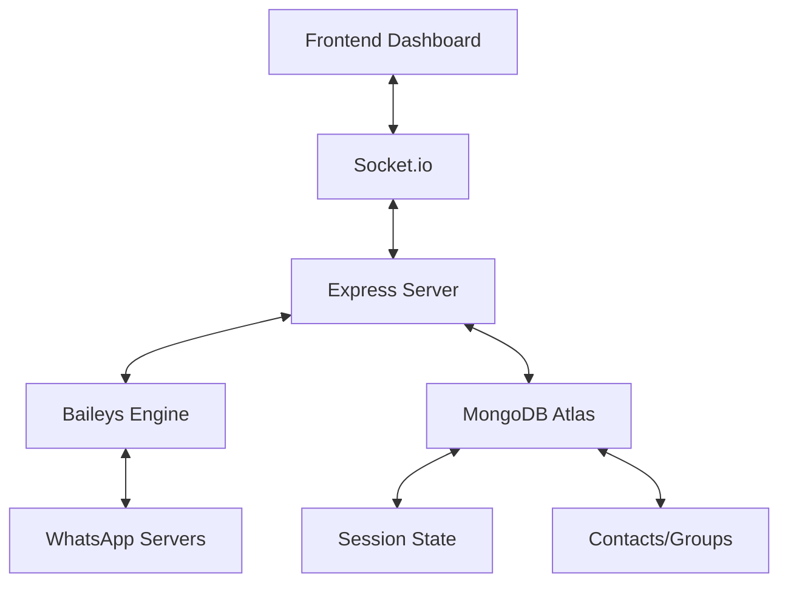

# Architecture

The system is a **Real-time Event-Driven Monolith** designed for high-availability on ephemeral cloud environments (like Render).

## Core Architecture Pillars

### 1. Unified State Management
- **Single Socket Singleton**: A central `sock` instance handles all WhatsApp traffic.
- **Hybrid Data Store**: Uses `Map` (for fast in-memory access) and `MongoDB` (for persistent cross-start consistency).
- **Socket.io Bridge**: Translates server-side logic and Baileys events into UI updates in real-time.

### 2. Lifecyle Safety
- **Safe Restart Pattern**: Prevents "Error 440: Conflict" by cleanly closing sockets and de-registering listeners before reconnection.
- **Rate-Limited Resets**: Prevents infinite reconnect loops during sync windows.

### 3. Data Flow
1. **Connection**: Server reads credentials from MongoDB -> Connects to WhatsApp.
2. **Synchronization**: WhatsApp sends history events -> Server upserts metadata to MongoDB.
3. **API Interaction**: Frontend requests actions -> Server executes via persistent socket.
4. **Maintenance**: Keep-alive pinger prevents server sleep.

## Component Interactions

